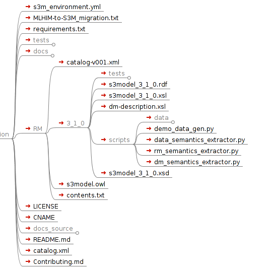

==============================================
The Reference Implementation - Reference Model
==============================================

S3Model may be implemented in most (any?) programming or data definition languages.

The **reference implementation** is in XML Schema. This is due to the ubiquitous nature of XML and the compatibility with RDF/XML and OWL for datatyping.

Virtually all modern programming and data analysis languages can manipulate and validate XML content.

The *catalog* system in XML solves many issues around namespacing and network latency by allowing local persistence of schemas and documents referenced at remote locations.

.. raw:: html

  
<a href='rm/index.html' target='_blank'>Reference Model Technical Schema Docs</a>

Distribution Layout
===================

The directory tree contains several files and directories.

The *scripts* directory content is described in the **Additional Tools** section.

-  The *RM* (reference model) directory contains one or more versioned subdirectories where the actual XML Schema and associated files are located. This directory also contains the S3Model ontology file *s3model.owl*.

- The *3_1_0* directory is the only versioned reference model in this distribution. Previous versions were removed. This directory contains the XML Schema, *s3model_3_1_0.xsd* which is the reference implementation of the S3Model specifications. It also contains the *s3model_3_1_0.rdf* file of the triples that were extracted from the XML Schema using the rm_semantics_extractor.py tool. The file *s3model_3_1_0.xsl* can be used to help visualize *s3model_3_1_0.xsd* in a browser and *dm-desciption.xsl* can be used to visualize data model schemas as html pages.

- s3model_3_1_0.xsd is the schema that is required by all S3Model Data Models using the xs:include.

.. code-block:: xml

    <xs:include schemaLocation="https://www.s3model.com/ns/s3m/s3model_3_1_0.xsd"/>

Examples
--------

The examples directory contains some simplistic versions of a data model schema and example RDF extract and instance documents.

